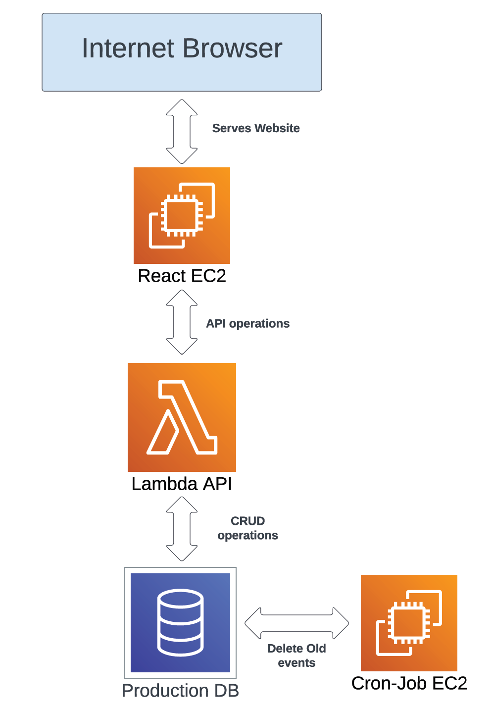

# Event Calendar

- This repo contains code to launch a website called "EventCalendar", which allows users to create and manage events
  associated with the University of Otago

## System Architecture

- The app is composed of several AWS services. A simplified diagram of the system is shown below:



### App parts

- An EC2 instance (`React EC2` as above) serves the website files to a web browser using React.
- The `React EC2` is served by an AWS Lambda instance (`Lambda API` as above). This handles API requests from the React wesbsite, and then
  completes CRUD operations with the production database. This is written in TypeScript using Express.js.
- The production database (`Production DB` as above) is implemented with an AWS RDS MySQL instance. 
- A further EC2 instance is used to delete old repeated events from the production database.

## Deploying to cloud platforms

### Deployment overview

- The app is deployed to AWS using a combination of Terraform and the Serverless framework.
- Terraform is used to deploy the RDS DB, and both the EC2 instances. The Lambda function is deployed using the
  Serverless framework
- Once the services are deployed, manually provisioning is required to make them production ready.

### Prerequisites:

- Deployment of this app requires a step by step deploy process
- Please make sure that you have valid AWS credentials specified in your .aws configuration file. These should be under
  the profile `event-calendar`
- Make sure you have npm, Terraform and the AWS CLI installed

#### Configuring the SSH key for EC2 instances

- Assuming that you have the provided SSH key (the .pem file) and that its in the top level project directory. You will
  need to make it visible to your local ssh client
- On Unix systems:

```shell
chmod 400 event-calendar.pem
```

- On Windows systems (make sure to substitute `<USERNAME>` for your Windows username)

```shell
icacls event-calendar.pem /inheritance:r /grant:r "<USERNAME>:R"
```

### Deploy with Terraform

- Now you can deploy the first lot of services using Terraform
- To deploy the React and Cron-Job EC2 instances, along with the RDS DB, run:

```shell
terraform init --upgrade
# Enter 'yes' when prompted
terraform apply 
```

#### Using the output of `terraform apply`:

- You will see that the host url of the RDS DB is printed out by Terraform. Set this to the value of `DB_HOST` in
  the `.env` files within the `cron-job` and `express-server` directories

```dotenv
# In cron-jon/.env and /express-server/.env
DB_HOST=XXXXX
```

- The Terraform deploy creates a Lambda security group necessary for the Express Lambda function. This should be
  referenced `serverless.yml`, in the configuration file of the Lambda function. The id of
  this security group is printed out after entering `terraform apply`. Copy this into the `provider` section
  of `express-server/serverless.yml` like so

```yaml
# express-server/serverless.yml
# ...Rest of file above

provider:
  # Other details...
  vpc:
    securityGroupIds:
      - <Lambda security group id>

# Rest of file below...
```

### Deploying the Lambda Express app

- Note: This must be done *after* deploying with Terraform, since Terraform creates the security groups used by the Lambda function.

- To deploy the Express API using the Serverless framework, enter:

```shell
cd express-server
npm run install-deploy
```

- Once you have deployed the Lambda, copy the API gateway address of the function (should be printed out by Serverless) to a new `.env` file
  at `react-app/.env` like so:

```dotenv
# In react-app/.env
API_HOST="XXXX"
```

### Provisioning

- After deployment, you will need to provision the RDS DB and the EC2 instances.
- The previous `terrafform apply` prints out the DNS addresses of the React and Cron-Job EC2 instances, use these for the next steps.
- Follow the next steps in the order that they appear.

#### Provisioning the DB

- To provision the DB, i.e. create the actual production database, you will need to first jump into the CRON job DB,
  then provision it from there
- First update the DB host name in the `sql-scripts/setup-db.sh`, using the value printed out by `terraform apply`. As so:
```shell
# Change this on redeploys of the RDS DB
export DB_HOST=XXXX # Use value of 'db-endpoint' from 'terraform apply', remove the :PORT extension from the end
```

- Now copy over the necessary sql scripts from your local machine to the cron-job ec2 with:

```shell
 scp -i "event-calendar.pem" -r ./sql-scripts admin@<cron-job-public-dns>:~/
```

- Then SSH into the cron-job ec2 using:

```shell
ssh -i "event-calendar.pem" admin@<cron-job-public-dns>
```

- Now enter these commands, one after the other, make sure they all are successful before going onto the next. Enter the
  DB password when necessary, a popup should ask you if you want to uninstall MariaDB, enter yes.

```shell
cd ./sql-scripts
chmod +x setup-db.sh
./setup-db.sh
cd ../
rm -r sql-scripts/
```


#### Provisioning the React instance:

- First, build the React app locally, this can be extraordinarily slow a small server, so do it locally first

```shell 
cd ./react-app
npm run build
cd ../
```

- Then remove your local `react-app/node_modules`, it's better to install dependencies fresh on the local ec2 instance

- Then copy over contents from the project directory to the ec2 instance with:

```shell
scp -i "event-calendar.pem" -r ./react-app admin@<react-app-public-dns>:~
```

- Then SSH into the instance with, making sure to replace <host> with the host of the EC2

```shell
ssh -i "event-calendar.pem" admin@<react-app-public-dns>
```

- To provision and run the instance, enter:

```shell
cd ./react-app
chmod +x provision_react.sh
./provision_react
```

#### Provisioning the Cron-Job instance

- Similarly copy over contents from the project directory to the ec2 instance with:

```shell
scp -i "event-calendar.pem" -r ./cron-job admin@<cron-job-public-dns>:~
```

- Then SSH into the instance with:

```shell
ssh -i "event-calendar.pem" admin@<cron-job-public-dns>
```

- To provision and run the instance, enter:

```shell
cd ./cron-job
chmod +x provision_cron_job.sh
./provision_cron_job
```
### Teardown

- To remove the Express lambda function (from within the `express-server` directory), enter:

```shell
npm run remove
```

- Note due to dependencies between the Terraform file and the Lambda function, the Lambda function needs to be torn down
  *before* destroying any services defined by Terraform

- To remove the other deployed services, enter:

```shell
terraform destroy
```

### Project directories

- `express-server` contains a Node.js project for the backend express.js API
- `react-app` contains a Node.js project for the frontend React app
- `sql-scripts` contains any configuration scripts of the MySQL RDS DB
- `cron-job` contains a micro project to run a cron-job within a container.